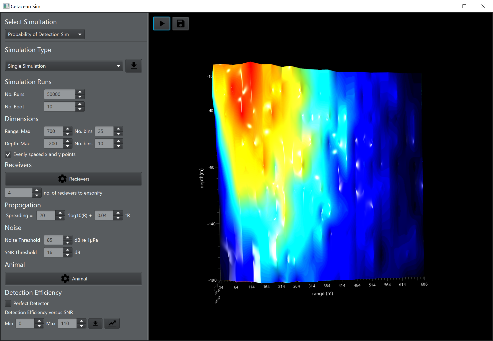

# CetSim
A program to calculate the probability of detecting vocalisations of marine mammals at different ranges and depths

# Introduction #

When surveying any vocalising animal using passive acoustic monitoring one of the most important parameters in calculating animal density is knowing the probability of detection, i.e. the probability of detecting a single vocalisation or vocalising animal at a certain range. There are numerous ways this can be done, for example measuring the ranges at which animals are detected or calibrating using another survey method. A last resort approach is to simulate the probability of detection based on prior knowledge of an animal's behaviour. In an underwater 3D context these parameters can include source levels, depth distribution, vertical diving angle, directionality of the sound and the performance of the receiving recorders. One approach to simulate the probability of detection is a Monte Carlo simulation e.g.

Frasier, K. E., Wiggins, S. M., Harris, D., Marques, T. A., Thomas, L., and Hildebrand J. A. (2016). “Delphinid echolocation click detection probability on near-seafloor sensors,” J. Acoust. Soc. Am. 140, 1918–1930. https://doi.org/10.1121/1.4962279

A Mprobability of detection Monte Carlo simulation basically places an animal at a random point in space then draws it’s direction, depth, and source levels from pre-defined probability distributions. For every receiver in the simulation the received level is calculated and if it is above a threshold on a minimum number of receivers the animal is detected, otherwise it is not detected. This process is repeated many tens or hundreds of thousands of times. The proportion of positive detections in binned ranges and depth is then the probability of detection. 

# CetSim #

CetSim is java library tom perform these simulations. Originally programmed in MATLAB simulations were taking 30 days. CetSim increases the speed of simulation by around 30 times. A MATLAB function can access the jar file allowing construction of scripts for data handling, plotting etc. CetSim also comes with it’s own JavaFX based GUI allowing users to play around with the simulation. Users can change settings, import and export settings in .mat file, run simualations and export the data as .mat files. 
Note:The GUI is still in Beta and some features have not been implemented. 

An example of the CetSim GUI showing a finished probability of detection simulation. 

# Builds #
A .jar file is and bin file is located in the cetacean_sim_builds folder. Double click the bin file to start the GUI. 

# MATLAB #
Copy the .jar file into the same folder as the sim_prob_det_java.m function to use in MATLAB. Note that MATLAB should be running on Java 8 for function to work. clickmethod_settings_jm.m creates a default settings structure for input into sim_prob_det_java.m. This settings structure can also be imported using the CetSim GUI. 

# Developer Notes #
CetSim is based on Java 8
